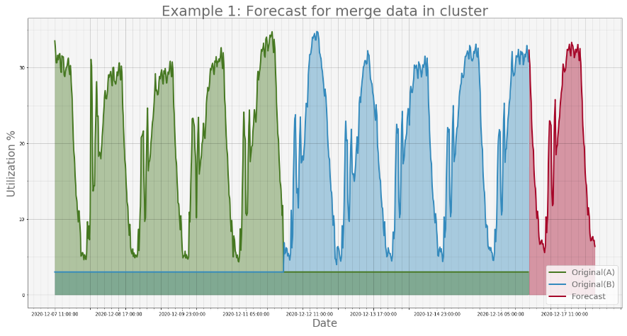
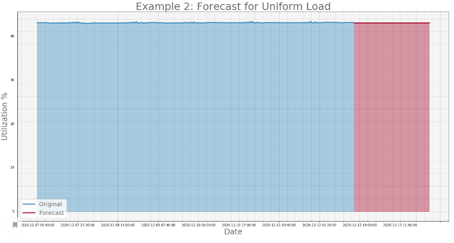
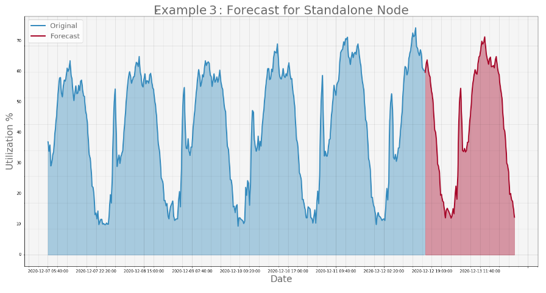

  

 


# Joyce : Anomaly Detection with Time Series Forecasting

This application predicted time series and finds deviations of current values from values predicted by the model. Using the difference in these values, we want to notice the abnormal load.

- Python3
- Zabbix
- Statsmodels (ARIMA)

## Installation

Snorkel requires Python 3.6 or later. To install Snorkel, we recommend using `pip`:

```bash
pip install snorkel
```



    
If the difference between the maximum and minimum values is less than threshold (for example 5), 
then we will predict the average value. Otherwise, the prediction algorithm goes crazy.
This is quite enough for us to detect anomalies.


 

